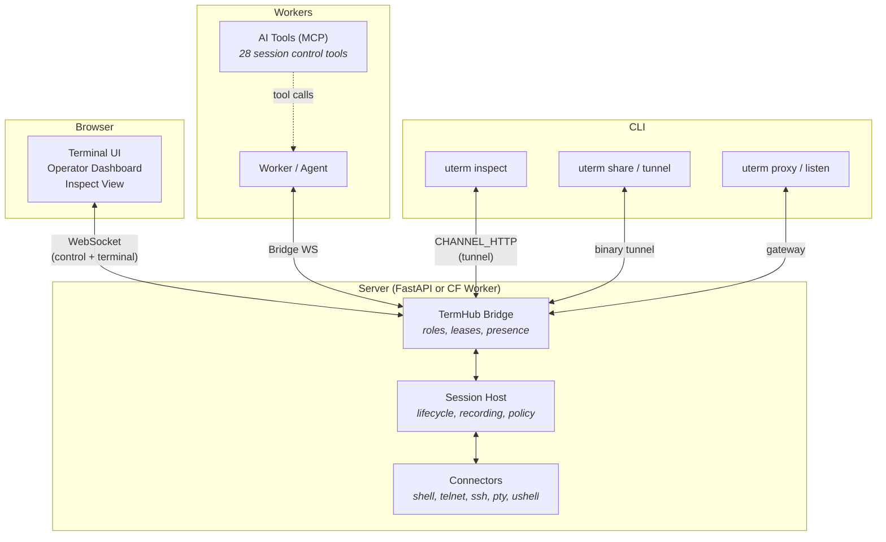
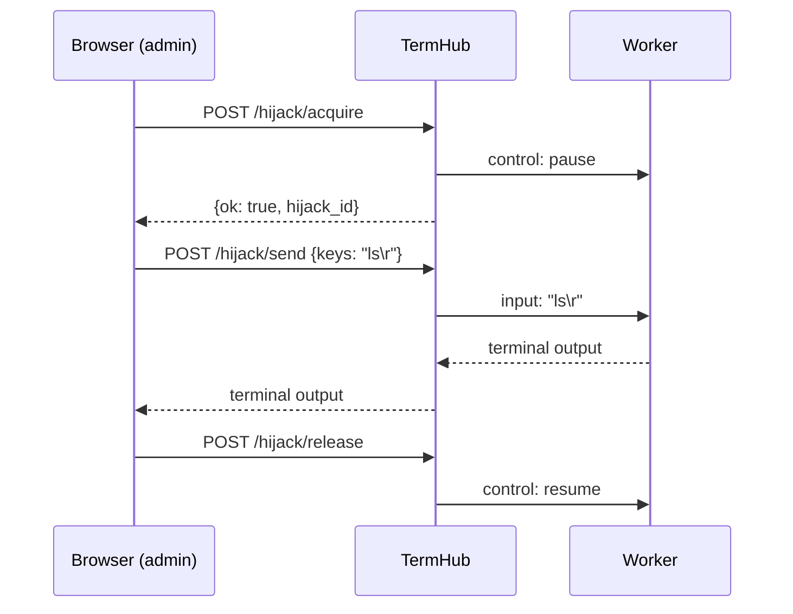
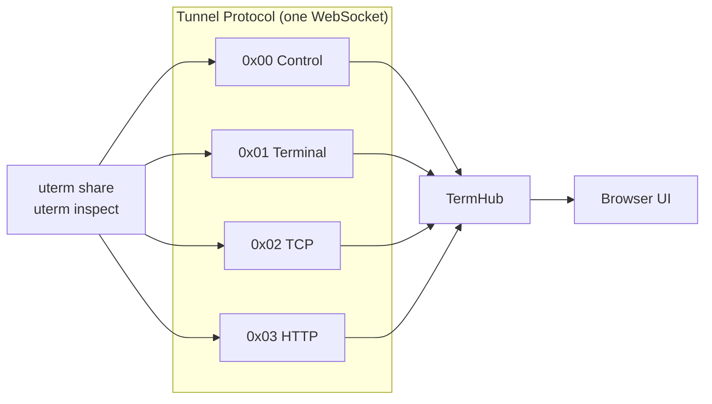
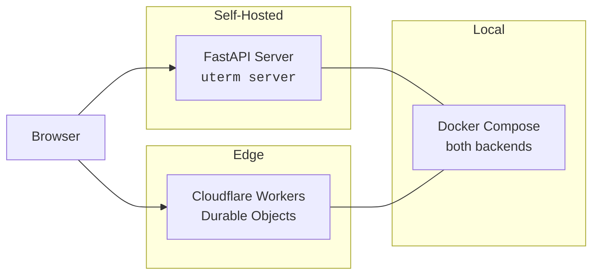

# provide-uterm

<p align="center">
  
</p>

<p align="center">
  <a href="https://github.com/provide-io/provide-uterm/actions/workflows/ci.yml"></a>
  <a href="https://github.com/provide-io/provide-uterm/actions/workflows/release-governance.yml"></a>
  <a href="https://github.com/provide-io/provide-uterm/actions/workflows/codeql.yml"></a>
  <a href="https://github.com/provide-io/provide-uterm/actions/workflows/container-scan.yml"></a>
  <a href="SECURITY.md"></a>
  <a href="https://www.python.org/downloads/"></a>
  <a href="LICENSE"></a>
</p>

A terminal access and control platform. Creates, transports, secures, shares, records, replays, and arbitrates terminal sessions across browsers, WebSockets, telnet, SSH, local PTYs, and remote workers.

> xterm.js is the screen. Provide Terminal is the whole system around the screen.

```
Terminal UI         Session Control       Collaborative Presence
HTTP Inspection     AI/MCP Tools          Tunnel Sharing
Session Replay      Multi-Backend         Agent Management
```

---

## Architecture



**Control channel** — JSON control frames (snapshots, hijack state, presence, analysis, browser-originated HTTP-inspect actions) are DLE/STX-framed and mixed inline with raw terminal bytes in the same WebSocket stream. Non-terminal WebSocket payloads must use the public framing helpers; CI rejects bare JSON sends on terminal/control WebSocket paths.

**Session model** — Named sessions with pluggable connectors, lifecycle management, JSONL recording, and policy enforcement.

**Bridge** — TermHub coordinates workers and browsers, enforces viewer/operator/admin roles, manages hijack ownership leases, and supports reconnect/resume tokens.

---

## Quick Start

### Embed a terminal in FastAPI

```python
from provide.uterm.fastapi_utils import mount_terminal_ui

app = FastAPI()
mount_terminal_ui(app)  # serves at /terminal
```

> FastAPI `mount_terminal_ui` / `WsTerminalProxy` is a **Python embedding helper**.
> Go and C# ship the same wire path via `uterm proxy` (permanent de-scope of the
> FastAPI mount in those ports — not the multi-backend hub).

### Run the reference server

```bash
pip install 'provide-uterm-server[server]'
uterm server --config server.toml
# Dashboard: http://localhost:27780/app/
```

### Extend the browser application

Browser consumers can register CSS theme tokens, navigation entries, custom page kinds,
and one authentication adapter without importing internal source paths:

```tsx
import {
  App,
  applyThemeTokens,
  createUtermExtensionRegistry,
} from "provide-uterm-app";

const extensions = createUtermExtensionRegistry();
extensions.register({
  id: "my-console",
  themeTokens: { "--bg-primary": "#050302" },
  navigation: [{ id: "reports", label: "Reports", href: "/reports", pageKind: "reports" }],
  pages: [{ kind: "reports", component: ({ bootstrap }) => <h1>{bootstrap.title}</h1> }],
  auth: {
    resolve: async () => ({ subject: "external-user", roles: ["reader"] }),
    authorize: (identity, capability) =>
      identity.roles.includes("reader") && capability === "reports.read",
  },
});

applyThemeTokens(document.documentElement, extensions.snapshot().themeTokens);
root.render(<App bootstrap={bootstrap} extensions={extensions} />);
```

The public React package also exports `SessionPage`, `TerminalHost`, `ReplayPage`, and
`HijackHost`. The framework-neutral `provide-uterm-frontend` package exports
`TerminalElement`, `UtermSessionElement`, `registerUtermElements`, and the DeckMux types.
Import `DeckMux` from the explicit `provide-uterm-frontend/deckmux` subpath. Other package
subpaths expose the terminal and session elements and DeckMux CSS directly.

These browser packages are private source packages, not registry artifacts. Supported
consumers install them from a reviewed local checkout and let a TypeScript-aware bundler
such as Vite compile the exported source. The consumer verification fixture exercises
that exact installation, typecheck, JavaScript, and CSS build path.

### Inspect HTTP traffic with interception

```bash
pip install 'provide-uterm-server[cli]'
uterm inspect 3000 --server https://your-server.example.com --intercept
```

---

## Core Capabilities

### Session Control (Bridge)

The bridge system lets operators observe and take over terminal sessions in real time.

- **Roles** — `viewer` (observe only), `operator` (input in shared mode), `admin` (full hijack control)
- **Hijack leases** — acquire/heartbeat/release with configurable TTL, auto-expire on disconnect
- **Input modes** — `hijack` (exclusive, one owner) or `open` (shared, all operators can type)
- **Session resumption** — browser reconnect restores role and hijack ownership via opaque tokens



### Terminal Transports

Pluggable connectors behind a unified session model:

| Connector | What it does |
|-----------|-------------|
| `shell` | Local shell process |
| `telnet` | Remote telnet (RFC 854) |
| `ssh` | Remote SSH (asyncssh) |
| `websocket` | WebSocket upstream |
| `ushell` | Built-in Python REPL (shell module in `provide-uterm`) |
| `pty` | Local PTY with PAM auth and LD_PRELOAD capture |

The **gateway** converts between protocols: browser WebSocket ↔ telnet/SSH backends with ANSI color mode negotiation.

### Tunnel Sharing & HTTP Inspection

Share terminals and inspect HTTP traffic through multiplexed binary tunnels.



- **`uterm share`** — share your local terminal through the tunnel server
- **`uterm tunnel`** — forward a local TCP port through the tunnel
- **`uterm inspect`** — HTTP reverse proxy with live traffic inspection
- **`uterm inspect --intercept`** — pause requests, forward/drop/modify from the browser

See [HTTP Inspection & Interception](https://github.com/provide-io/provide-uterm/blob/main/docs/inspect.md) for the full protocol reference.

### Collaborative Presence (DeckMux)

Real-time collaborative features on any terminal session:

- **Avatar bar** — colored circles with initials, role badges, idle/typing indicators
- **Edge indicators** — minimap-style viewport bars showing where each user is scrolled
- **Pinned cursors** — click a line to pin your position, visible to all watchers
- **Control transfer** — request/handover/auto-transfer with keystroke queue buffering

Enable per-session with `presence: true`. Works on both FastAPI and CF backends at parity.

### AI/MCP Integration

28 tools for AI agents to control terminal sessions via the [Model Context Protocol](https://modelcontextprotocol.io/):

```bash
uterm-mcp  # starts MCP server for Claude, GPT, or any MCP-compatible agent
```

Tools include `session_create`, `session_read`, `session_subscribe`, `hijack_begin`, `hijack_send`, `hijack_step`, `hijack_release`, and more. See [provide-uterm-client](https://github.com/provide-io/provide-uterm/tree/main/packages/provide-uterm-client).

### Agent Management

Orchestrate fleets of terminal workers:

```bash
uterm-manager --config swarm.yaml
```

Process lifecycle, heartbeat monitoring, auto-respawn, fleet pause/resume, timeseries metrics, and WebSocket status broadcasting. See [provide-uterm-platform](https://github.com/provide-io/provide-uterm/tree/main/packages/provide-uterm-platform).

---

## CLI Tools

| Entry Point | Purpose |
|-------------|---------|
| `uterm` | Terminal proxy, sharing, tunneling, inspection |
| `uterm server` | Hosted reference server with sessions, auth, UI (subcommand of `uterm`) |
| `uterm-mcp` | MCP server for AI agents |
| `uterm-manager` | Agent swarm orchestration |

### `uterm` commands

| Command | Description |
|---------|-------------|
| `proxy HOST PORT` | Browser WS → telnet/SSH proxy |
| `listen WS_URL` | Telnet/SSH client → WebSocket |
| `share [CMD]` | Share local terminal via tunnel |
| `tunnel PORT` | Forward TCP port via tunnel |
| `inspect PORT` | HTTP traffic inspection (add `--intercept` for pause/edit) |
| `watch` | TUI for watching HTTP tunnel traffic |

---

## Installation

```bash
pip install provide-uterm                  # core only
pip install 'provide-uterm[emulator]'      # + pyte screen emulation
pip install 'provide-uterm-server[cli]'    # CLI tools (uterm, incl. `uterm server`)
pip install 'provide-uterm-server[server]' # hosted server
pip install 'provide-uterm-client[all]'    # client + MCP tools
```

**provide-uterm extras:**

| Extra | Installs | Required for |
|-------|----------|-------------|
| `[emulator]` | pyte | Screen state tracking |
| `[ssh]` | asyncssh | SSH transport |
| `[client]` | httpx | HTTP client |
| `[all]` | everything above | Full core feature set |

**provide-uterm-server extras:**

| Extra | Installs | Required for |
|-------|----------|-------------|
| `[server]` | fastapi, uvicorn, pyjwt, websockets | Reference server |
| `[cli]` | fastapi, uvicorn, websockets, textual, httpx | CLI tools |
| `[tunnel]` | httpx, uvicorn, websockets, fastapi | Tunnel sharing |
| `[gateway]` | asyncssh, websockets | Telnet/SSH gateways |
| `[all]` | everything above | Full server feature set |

---

## Deployment

**Served server backends** — Python (FastAPI), Go, C#, and Cloudflare
Workers/Durable Objects. The TypeScript package `provide-uterm-ts` is a
**partial** runtime port: its libraries are complete and differentially tested,
but its Node server mounts only part of the shared HTTP contract, so it is not
a served backend. `served`, `unserved`, `unsupported`, `partial`, and `N/A`
mean one thing each across every parity table — see
[Parity Labels](https://github.com/provide-io/provide-uterm/blob/main/docs/parity-labels.md).



**FastAPI** — full control, named sessions, auth, recording, policy. Deploy anywhere Python runs.

**Durability note** — the standalone FastAPI server keeps live control-plane state in process memory only. Tunnel tokens/share state, approvals, resume state, webhook registrations, and live session arbitration state are not HA or persistent across restart/failover. Run a single active instance if you use this backend, or choose the Cloudflare Workers/Durable Objects deployment when you need durable multi-node behavior.

**Cloudflare Workers** — edge deployment on [Durable Objects](https://github.com/provide-io/provide-uterm/tree/main/packages/provide-uterm-cloudflare) with CF Access JWT, KV session registry, WebSocket hibernation.

**Docker** — both backends locally:
```bash
docker compose -f docker/docker-compose.yml up
# FastAPI: http://localhost:27780/app/
# CF Worker: http://localhost:27788/api/health
```

---

## Package Ecosystem

| Package | Role | Tests |
|---------|------|-------|
| `provide-uterm` | Core: ansi, screen, emulator, protocols, detection, deckmux, shell, render, replay | ~3600 |
| `provide-uterm-server` | Server: bridge hub, FastAPI, CLI, tunnel, gateway | ~2800 |
| `provide-uterm-client` | Client: HTTP/WS client, transports, AI/MCP | ~690 |
| `provide-uterm-platform` | Platform: PTY, PAM, capture, External Management Tier | ~780 |
| `provide-uterm-cloudflare` | CF Worker + Durable Object | ~890 |
| `provide-uterm-annotation` | Annotation layer | — |
| `provide-uterm-frontend` | Browser UI (TypeScript, xterm.js) | — |
| `provide-uterm-app` | App shell | — |

All Python packages at 100% branch+line coverage. 8760+ tests total.

## Control-channel parity benchmarks

Use these commands to run the new cross-runtime decoder parity benchmarks.

```bash
# Quick local check (smaller dataset, faster)
make benchmark-control-channel-quick

# Full local parity run (all backends) with JSON artifact
make benchmark-control-channel

# Equivalent direct script form
uv run python scripts/benchmark_control_channel_parity.py \
	--output-json /tmp/control-channel-parity.json
```

Optional tuning arguments: `--frame-count`, `--passes`, `--chunk-size`, `--data-size`,
`--control-size`, `--control-ratio`, `--baseline-revision`, `--seed`, `--backends`.

The script prints machine-independent normalized throughput (`x fastest`) and writes
JSON suitable for CI artifact inspection (`backends`, raw `results`, and
`normalization` payload).

CI execution:

- Dispatch the `🧪 CI` workflow (`workflow_dispatch`).
- The `control-channel-parity-benchmark` job runs for `python`, `csharp`, `go`,
  and `typescript`, writing `control-channel-parity.json` as a workflow artifact.

---

## Security & Quality

- **Auth modes** — `dev_token` (local), `jwt` (production), `header`, `api_key`, `webhook`; fail-closed on misconfiguration <!-- pragma: allowlist secret -->
- **Security headers** — CSP, HSTS, X-Frame-Options, SRI integrity hashes (configurable per-header)
- **100% branch coverage** — enforced via `--cov-fail-under=100` in every package
- **Pre-commit** — ruff, reuse, codespell, bandit, detect-secrets on every commit; mypy/ty/frontend hooks are manual-staged
- **Security audit** — `pip-audit`, `bandit`, timing-safe token comparison

---

## Docs

- [HTTP Inspection & Interception](https://github.com/provide-io/provide-uterm/blob/main/docs/inspect.md)
- [Protocol Matrix](https://github.com/provide-io/provide-uterm/blob/main/docs/protocol-matrix.md) — backend capability contract
- [Parity Labels](https://github.com/provide-io/provide-uterm/blob/main/docs/parity-labels.md) — what `served` / `unserved` / `unsupported` / `partial` / `N/A` mean
- [Security Language Parity](https://github.com/provide-io/provide-uterm/blob/main/docs/security-language-parity.md) — per-language security scope
- [Testing Guide](https://github.com/provide-io/provide-uterm/blob/main/docs/TESTING.md)
- [Operations Runbook](https://github.com/provide-io/provide-uterm/blob/main/docs/operations/runbook.md)
- [Service SLOs](https://github.com/provide-io/provide-uterm/blob/main/docs/operations/slo.md)
- [Release Governance](https://github.com/provide-io/provide-uterm/blob/main/docs/release-governance.md)
- [Architecture Diagrams](https://github.com/provide-io/provide-uterm/tree/main/docs/diagrams) (PlantUML)
- [Cloudflare Workers](https://github.com/provide-io/provide-uterm/blob/main/packages/provide-uterm-cloudflare/README.md)

---

## License

AGPL-3.0-or-later. Copyright (c) 2025-2026 provide.io llc.
