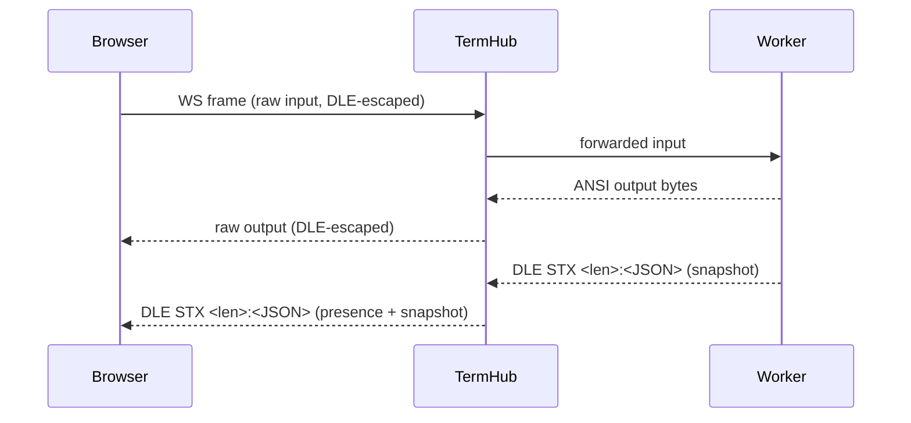
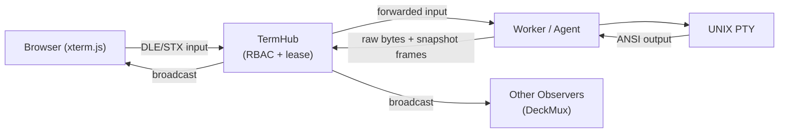

# provide-uterm Architecture Report

This document provides a comprehensive analysis of the **provide-uterm** ecosystem, detailing its architecture, implementation patterns, core protocols, and advanced capabilities.

---

## 1. Architectural Vision
The project is built around the concept of a **Collaborative Control Plane** for terminal sessions. It decouples the terminal I/O from the transport and orchestration, allowing the same terminal "brain" to run on a local server, at the network edge (Cloudflare), or within an AI agent's environment.

---

## 2. Core Innovation: Inline Control Channel
The most critical low-level component is the **Control Channel Framing** (`control_channel.py`). Unlike traditional systems that use separate WebSockets or side-channels for control, `provide-uterm` multiplexes everything into a single stream using **DLE/STX framing**.

### Protocol Details
- **DLE** (`0x10`) is the escape character.
- **Data**: Raw terminal bytes have their `DLE` bytes doubled (`0x10 0x10`) to escape them.
- **Control Frames**: Encoded as `DLE STX [8-hex length] : [JSON]`.

### Why?
This ensures perfect synchronization between terminal output and metadata (like resizing, presence updates, or annotations). It works identically in Python (server) and TypeScript (browser), preventing the race conditions common in multi-channel terminal proxies.

### Control Channel Sequence

---

## 3. Package Ecosystem

| Package | Purpose | Key Technologies | Architectural Role |
| :--- | :--- | :--- | :--- |
| **`provide-uterm`** (Core) | Shared terminal primitives and ANSI processing. | Python 3.11+, `pyte`, `aiosqlite`. | The **"Brain"**. Implements screen state, ANSI decoding, and the `DeckMux` collaboration logic. |
| **`provide-uterm-server`** | The orchestration hub (**TermHub**). | FastAPI, `uvicorn`, `websockets`. | The **Reference Hub**. Orchestrates sessions, manages RBAC/Leases, and provides the reference self-hosted backend. |
| **`provide-uterm-cloudflare`** | Serverless Edge backend. | Cloudflare Workers, Durable Objects (DO). | The **Edge Hub**. Provides a distributed version of TermHub with each session isolated in a Durable Object. |
| **`provide-uterm-client`** | Programmatic access and AI tools. | `httpx`, `fastmcp`. | The **Interface Layer**. Provides the Python SDK and MCP tools for AI agents. |
| **`provide-uterm-platform`** | Host-side interaction (PTY/Agent). | Local PTYs, PAM auth. | The **Agent Tier**. Manages local process lifecycle and bridges real PTYs to the virtual control plane. |
| **`provide-uterm-frontend`** | Browser-based terminal UI. | TypeScript, `xterm.js`, Vanilla CSS. | The **User Interface**. Implements the `DeckMux` UI and terminal rendering. |

---

## 4. Deep-Dive Implementation Analysis

### ANSI Engine (`ansi.py`)
A sophisticated normalization engine that handles legacy "dialects" (BBS pipe codes, tilde codes, TWGS brace tokens) and upgrades them to modern 256-color or TrueColor. It ensures that output from older systems is rendered with high fidelity in modern browsers.

### TermHub (`hub/core.py`)
The central orchestration engine in the server package. It uses a mixin-based architecture to manage:
- **State Management**: Tracking active workers and browsers.
- **Messaging**: Routing data between participants.
- **Hijack Ownership**: Managing exclusive control leases for terminal input.

### DeckMux (Collaboration Layer)
Treats collaboration as a first-class citizen rather than an afterthought.
- **Presence**: Real-time visibility into observers with adjective-animal naming and deterministic HSL colors.
- **Transfer Manager**: Manages the "Lease" logic. When an operator is idle, control can automatically transfer or be requested.
- **Keystroke Queuing**: Allows observers to "type ahead" while waiting for control, with their input displayed as ephemeral overlays for others.

---

## 5. Security & Authorization
- **Pluggable Authorization (`authorization.py`)**:
    - **LocalProvider**: Standard RBAC with roles: `viewer`, `operator`, `admin`.
    - **WebhookProvider**: Delegates every decision to an external API, allowing integration into large enterprise systems.
- **Tunnel Security**: Uses in-memory tokens for binary tunnels, supporting IP binding and automatic token rotation/sweeping to prevent unauthorized access to session streams.

---

## 6. Communication & Tunneling Protocol
The system defines a **Channel-Based Multiplexing** protocol over WebSockets for tunneling:
- `0x00`: **Control** (Resize, heartbeat).
- `0x01`: **Terminal** (Raw PTY bytes).
- `0x02`: **TCP Forwarding** (Raw socket data).
- `0x03`: **HTTP Inspection** (Structured JSON for captured requests/responses).

---

## 7. Edge Backend: Cloudflare Durable Objects
The `provide-uterm-cloudflare` package allows the control plane to run entirely serverless at the network edge.
- **Durable Objects (DO)**: Each terminal session is orchestrated by a single DO instance.
- **SQLite Persistence**: DOs use attached SQLite storage to persist session metadata, chat, and annotations, ensuring high performance without a central database bottleneck.

---

## 8. AI Agent Integration: Model Context Protocol (MCP)
AI models (like Claude) can securely participate in terminal sessions using the **Model Context Protocol (MCP)**.
- **FastMCP Server**: Exposes tools for session discovery, hijack control, snapshot capture, and collaboration.
- **Collaborative AI**: An agent can not just "read" the terminal, but also place visual **annotations** on the screen or participate in the **DeckMux chat** to coordinate with human operators.

---

## 9. Fleet Orchestration: Multi-Session Fan-Out
The Fan-Out controller allows an operator to broadcast input to N target sessions simultaneously.
- **Divergence Detection**: Uses Levenshtein similarity to compare output deltas across sessions, immediately flagging servers where the response differs from the majority.
- **Sequential Mode**: Supports rolling deployments with automatic halting on detected failures.

---

## 10. End-to-End Data Flow
1. **Browser Input**: Encoded into the DLE/STX format and sent over WebSocket.
2. **Hub Ingestion**: The Hub decodes the stream and validates the `hijack` lease.
3. **Worker Dispatch**: Input bytes are forwarded to the Worker (Agent).
4. **Agent/PTY**: The local agent writes the bytes to the UNIX PTY.
5. **Execution & Output**: The PTY emits ANSI output, which the agent captures.
6. **Snapshot & Broadcast**: The Hub updates its emulator, captures a screen snapshot, and broadcasts raw bytes and metadata to all observers via the `DeckMux` layer.

---

## Conclusion
`provide-uterm` is a **Terminal Orchestration Platform** that abstracts the terminal into a stateful, collaborative, and programmable data plane. It bridges human operators, automated orchestration, and AI agents into a single, cohesive, and fully audited environment.
