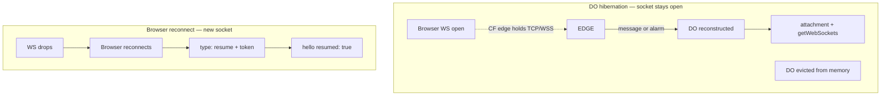

# CF hibernation + resume UX / settings

**Status:** as-built inventory + product decisions
**Date:** 2026-07-12
**Related:** [cf-do-architecture.md](../../packages/provide-uterm-cloudflare/docs/cf-do-architecture.md), frontend `hijack-websocket.ts` / `session-element.ts`

## Does hibernation “work”?

### What is proven today

| Layer | Proof | Live CF DO eviction? |
|-------|--------|----------------------|
| DO accepts hibernatable sockets (`acceptWebSocket` + attachment) | Code + unit tests | No |
| Post-wake role recovery (`deserializeAttachment` / `_socket_role`) | Unit tests | No |
| `getWebSockets()` broadcast after in-memory wipe | Unit tests | No |
| SQLite `_restore_state()` (lease wall-clock, etc.) | Unit tests | No |
| Browser **session resume** via one-time token | Unit (`test_cf_resume.py`) + e2e markers (`test_e2e_ws.py`, needs `real_cf`) | Only if `real_cf` env |
| Frontend “Waking…” + reconnect spinner | Vitest frontend tests | Browser-local |

**Honest bar:** hibernate *logic* is designed and unit-tested against fakes.
**Full proof** needs a `real_cf` (or miniflare/workerd) run that:

1. Opens browser WSS → DO.
2. Forces DO eviction / idle hibernation (or waits for CF idle).
3. Sends a frame or reconnects.
4. Asserts worker still routes, snapshot/hello restore, optional `resumed: true`.

That live step is **not** green in default CI (marked / optional). To determine “it works” for production: run `real_cf` e2e or a manual wrangler session.

### Two different “sleep” stories



- **Hibernation:** user may not reconnect; DO wakes in place. Frontend may show **Waking…** while `worker_online` is false.
- **Resume token:** used when the **browser** socket dies (network blip, tab sleep, proxy timeout). Independent of DO hibernate, but shares UX (“getting session back”).

## What the UI does today

| Signal | When | UI |
|--------|------|-----|
| `Waking…` (warn) | WS open, `workerOnline === false`, not timed out | Status dot amber |
| `Offline` (bad) | WS open, worker still offline after ~10s | Red |
| Reconnect spinner (xterm) | Reconnecting after close | Cyan braille animation in terminal |
| `Connected (watching/shared/…)` | Worker online | Green |
| Resume token | `hello.resume_token` → `sessionStorage` | **No visible “Resumed” label** |
| `hello.resumed` | Server can set `resumed: true` after successful token | **Frontend does not surface it** |

So: there is a **wake** indicator, not a **session resumed** indicator.

## Recommended: resume / hibernate indicators

### Status strings (session chrome)

| State | Dot | Text | Trigger |
|-------|-----|------|---------|
| Connecting | bad | Connecting… | first open |
| Waking DO / worker | warn | Waking… | existing |
| Session restored | live (brief) | Resumed | `hello.resumed === true` for ~2–3s, then normal Connected |
| Reconnecting | bad | Reconnecting in Ns… | existing |
| Offline worker | bad | Offline | existing |

Optional subtle toast: “Session restored (role: operator)” when `resumed`.

### Visual options

1. **Status bar only** (minimal) — extend `_updateStatus()` / `setStatus`.
2. **LED pulse** — reuse `data-led-indicator` with a third class `resuming`.
3. **Terminal banner** — one-line notice (noisy; prefer status bar).

### Distinguish DO wake vs token resume

| Event | How we know | Label |
|-------|-------------|--------|
| DO/worker cold | `worker_connected` after Waking | Connected |
| Token resume | `hello.resumed === true` | **Resumed** |
| Plain reconnect without token | hello without resumed | Connected |

Wire: in `session-element` hello handler, if `msg.resumed`, `setStatus("live", "Resumed")` then after timeout call `_updateStatus()`.

## Settings / knobs (server + client)

### Already partially wired

| Knob | Today | Gap |
|------|--------|-----|
| `resume_ttl_s` | Read via `getattr(config, "resume_ttl_s", 300)` | **Not on `CloudflareConfig`** — always 300s |
| Resume tokens | SQLite `resume_tokens` | OK |
| Waking timeout | Frontend `WAKING_TIMEOUT_MS = 10_000` | Hardcoded |

### Proposed config (CF Worker env / `CloudflareConfig`)

| Env / field | Default | Meaning |
|-------------|---------|---------|
| `RESUME_TTL_S` | `300` | Resume token lifetime |
| `RESUME_ENABLED` | `true` | Mint/accept resume tokens (kill-switch) |
| `WAKING_TIMEOUT_MS` | `10000` | Could stay client-only; optional hello capability |
| `HIBERNATE_HEARTBEAT_S` | (alarm already 60s KV) | Document only unless product wants different |

### Proposed client settings (`ProvideHijack` / session-element config)

| Setting | Default | Meaning |
|---------|---------|---------|
| `showResumeIndicator` | `true` | Show “Resumed” flash |
| `resumeIndicatorMs` | `2500` | How long to show Resumed |
| `wakingTimeoutMs` | `10000` | Match server expectation |
| `reconnectEnabled` | `true` | Existing behavior |
| `persistResumeToken` | `true` | sessionStorage on/off (privacy / shared machine) |

## Acceptance checklist (to *know* it works)

```bash
bash scripts/prove_cf_hibernate_resume.sh          # Level A (always)
bash scripts/prove_cf_hibernate_resume.sh --real-cf # Level B (wrangler/CF)
```

| # | Check | How |
|---|--------|-----|
| 1 | Hibernate wake contract | `test_hibernate_wake_contract.py` — wipe memory → SQLite lease → `getWebSockets` broadcast |
| 2 | Attachment ≠ identity | same — `_socket_role` after clearing `worker_ws` |
| 3 | Resume tokens | `test_cf_resume.py` — mint/TTL/revoke + `resumed: true` |
| 4 | UI “Resumed” | `session-element` on `hello.resumed` (~2.5s flash) |
| 5 | Config | `RESUME_TTL_S` / `RESUME_ENABLED` |
| 6 | Live CF | `pytest -m real_cf …/test_e2e_ws.py -k resume` or staging idle/evict |

## Suggested implementation order

1. **Config:** add `resume_ttl_s` (+ optional `resume_enabled`) to `CloudflareConfig.from_env`.
2. **UI:** honor `hello.resumed` → “Resumed” status flash.
3. **Client config:** `showResumeIndicator` / `persistResumeToken`.
4. **Proof:** enable or document `real_cf` e2e in CI nightly; document manual hibernate check.
5. **Docs:** link this file from CF README + operations runbook.

## Out of scope

- Changing CF billing / always-on DOs.
- Faking hibernation without workerd/CF (unit mocks already cover code paths).
- Full browser redesign beyond status chrome.
