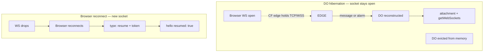

# CF hibernation + resume UX / settings

**Status:** as-built (Level A proven; Level B optional live CF)
**Date:** 2026-07-12
**Related:** [cf-do-architecture.md](../../packages/provide-uterm-cloudflare/docs/cf-do-architecture.md), frontend `hijack-websocket.ts` / `session-element.ts`

## Does hibernation “work”?

### What is proven today

| Layer | Proof | Live CF DO eviction? |
|-------|--------|----------------------|
| DO accepts hibernatable sockets (`acceptWebSocket` + attachment) | Code + unit tests | No |
| Post-wake role recovery (`deserializeAttachment` / `_socket_role`) | Unit tests + demo | No |
| `getWebSockets()` broadcast after in-memory wipe | Unit tests + demo | No |
| SQLite `_restore_state()` (lease wall-clock, etc.) | Unit tests + demo | No |
| Browser **session resume** via one-time token | Unit (`test_cf_resume.py`) + demo; e2e markers (`test_e2e_ws.py`, needs `real_cf`) | Only if `real_cf` env |
| Frontend **“Resumed”** flash | `session-element.ts` + vitest `session-element-resume.test.ts` | Browser-local |
| Frontend “Waking…” + reconnect spinner | Vitest frontend tests | Browser-local |

**Honest bar:** hibernate *logic* is designed and unit-tested against fakes.
**Full proof** needs a `real_cf` (or miniflare/workerd) run that:

1. Opens browser WSS → DO.
2. Forces DO eviction / idle hibernation (or waits for CF idle).
3. Sends a frame or reconnects.
4. Asserts worker still routes, snapshot/hello restore, optional `resumed: true`.

That live step is **not** green in default CI (marked / optional).

```bash
# Level A (always — demo + unit + frontend flash)
bash scripts/prove_cf_hibernate_resume.sh

# Standalone banner demo (same two paths as the recording demos)
uv run python scripts/demo_cf_hibernate_resume.py

# Level B (optional live)
bash scripts/prove_cf_hibernate_resume.sh --real-cf
```

### Two different “sleep” stories



- **Hibernation:** user may not reconnect; DO wakes in place. Frontend may show **Waking…** while `worker_online` is false.
- **Resume token:** used when the **browser** socket dies (network blip, tab sleep, proxy timeout). Independent of DO hibernate, but shares UX (“getting session back”).

## What the UI does today

| Signal | When | UI |
|--------|------|-----|
| `Waking…` (warn) | WS open, `workerOnline === false`, not timed out | Status dot amber |
| `Offline` (bad) | WS open, worker still offline after ~10s | Red |
| Reconnect spinner (xterm) | Reconnecting after close | Cyan braille animation in terminal |
| `Connected (watching/shared/…)` | Worker online | Green |
| Resume token | `hello.resume_token` → `sessionStorage` (`uterm_resume_<workerId>`) | Silent persist |
| `hello.resumed` | After successful `type: resume` | **“Resumed”** status for ~2.5s, then normal Connected |

## Settings / knobs

| Env / field | Default | Meaning |
|-------------|---------|---------|
| `RESUME_TTL_S` | `300` (min 30) | Resume token lifetime (`CloudflareConfig.resume_ttl_s`) |
| `RESUME_ENABLED` | `true` | Mint/accept resume tokens kill-switch (`resume_enabled`) |

When `RESUME_ENABLED=0`:

- Hibernation open hello still sends; `resume_supported=false`, no `resume_token`.
- `_handle_resume` returns immediately (token not consumed).

Client: on WS open, if `sessionStorage` has a token, browser sends `{type:"resume", token}` (see `hijack-websocket.ts`).

## Acceptance checklist

| # | Check | How |
|---|--------|-----|
| 1 | Hibernate wake contract | `test_hibernate_wake_contract.py` / demo path 1 |
| 2 | Attachment ≠ identity | same |
| 3 | Resume tokens | `test_cf_resume.py` / demo path 2 |
| 4 | UI “Resumed” | vitest `session-element-resume.test.ts` |
| 5 | Config | `RESUME_TTL_S` / `RESUME_ENABLED` |
| 6 | Live CF | `pytest -m real_cf …/test_e2e_ws.py -k resume` or staging idle/evict |

## Out of scope

- Changing CF billing / always-on DOs.
- Faking live CF eviction without workerd/CF (unit mocks cover code paths).
- Full browser redesign beyond status chrome.
