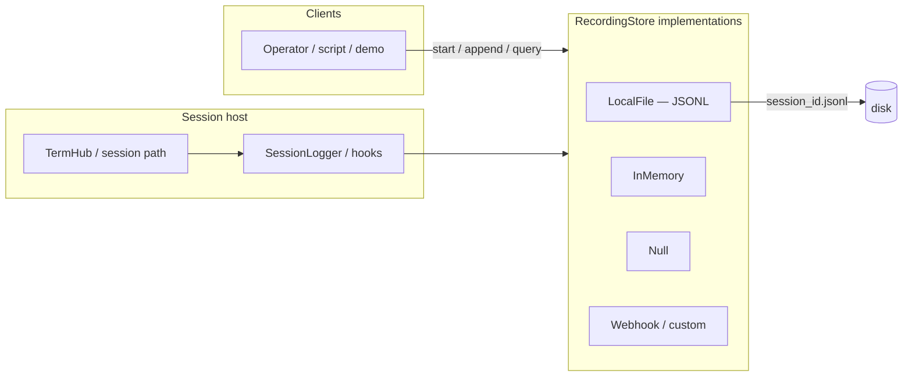
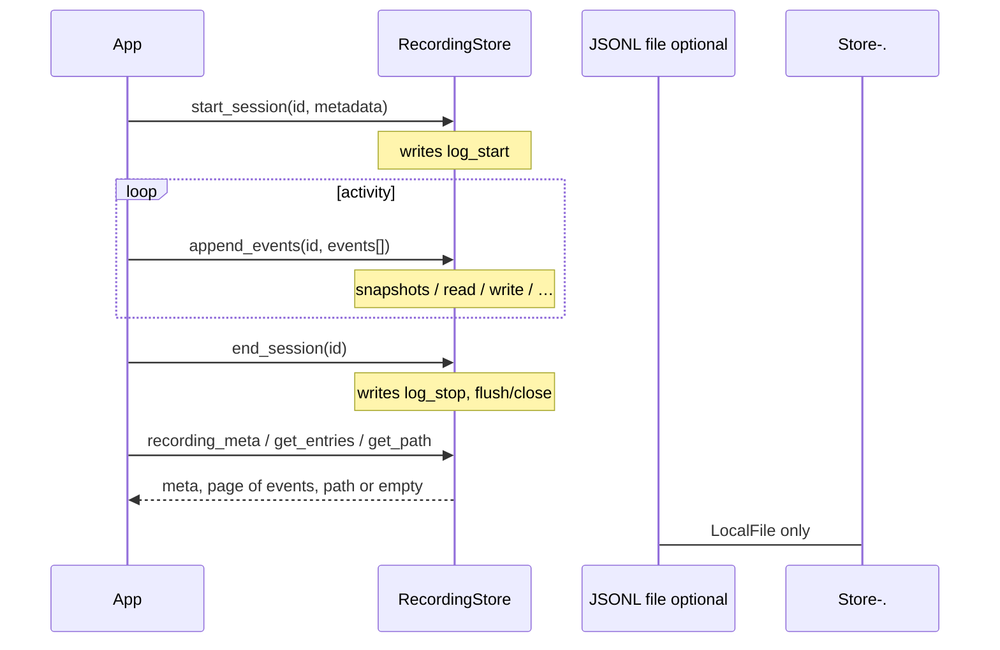
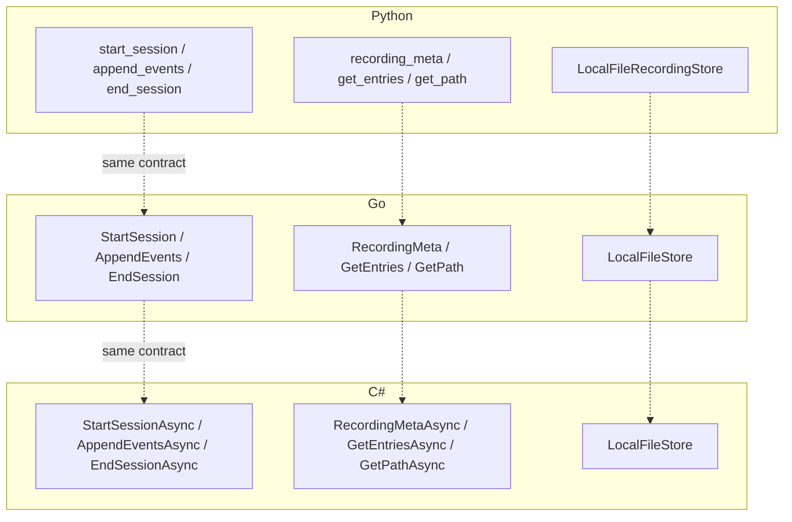
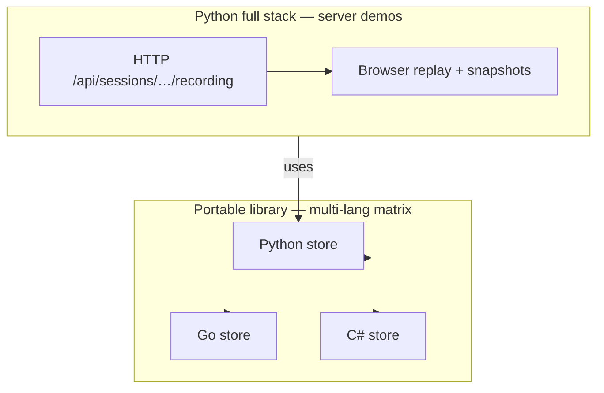

# Recording store — multi-language parity

This document describes the **portable `RecordingStore` contract** shared by
Python, Go, and C#, how the pieces fit together, and how to re-record the
library-level demos.

Operator-facing data handling (PII, retention, defaults) remains in
[recording-data-handling.md](./recording-data-handling.md). The ARD for
compliance recording is [ard-session-audit-compliance-recording.md](../ard-session-audit-compliance-recording.md).

## TL;DR

| Layer | Same? | Notes |
|-------|-------|--------|
| Lifecycle (start → append* → end) | **Yes** | All three ports |
| Event JSON shape | **Yes** | `{ts, event, data, session_id?}` |
| Query semantics (`limit` / `offset` / event filter) | **Yes** | `limit=0` → default **200**, clamp **1..500** |
| Stores LocalFile / InMemory / Null | **Yes** | Same roles |
| Public method names / async style | **No** | Idiomatic per language |
| Full HTTP/server recording surface | **Python-led** | Go/C# ship the library store first |

Python is the **behavioral source of truth**. Go and C# match that behavior with
idiomatic surfaces (sync+error, `Task`/`Async`).

## Architecture

### Where the store sits



### Lifecycle (all languages)



### Cross-language map



## Contract details

### Methods

| Semantic | Python | Go | C# |
|----------|--------|-----|-----|
| Start | `start_session` | `StartSession` | `StartSessionAsync` |
| Append batch | `append_events` | `AppendEvents` | `AppendEventsAsync` |
| End | `end_session` | `EndSession` | `EndSessionAsync` |
| Meta | `recording_meta` → `dict` | `RecordingMeta` → `Meta` | `RecordingMetaAsync` → `Meta` |
| Query | `get_entries(..., limit, offset, event)` | `GetEntries(id, Query)` | `GetEntriesAsync(id, Query)` |
| Path | `get_path` → `Path \| None` | `GetPath` → `""` if none | `GetPathAsync` → `""` if none |

### `get_entries` rules (parity-critical)

| Input | Behavior |
|-------|----------|
| `limit` omitted / default | **200** |
| `limit == 0` | **200** (explicit zero is not “clamp to 1”) |
| `limit` other | clamp to **1..500** |
| `offset is None` / null | **tail**: last `limit` matching events |
| `offset >= 0` | skip that many matches, then take `limit` |
| `offset < 0` | skip **nothing** (treat as 0) |
| `event` set | only rows with `event` field equal to filter |
| Missing session / file | empty list, not an error |

### Event model (JSONL line)

Minimum keys on each line:

```json
{"ts": 1710000000.0, "event": "snapshot", "data": {"screen": "…", "seq": 0}, "session_id": "demo"}
```

Lifecycle events written by the store:

| `event` | When |
|---------|------|
| `log_start` | `start_session` |
| `log_stop` | `end_session` |

Application/demo events commonly use `snapshot`, `read`, `write`, etc. under
`event` + structured `data` (including optional full `screen` text for replay).

### Local file store

| Behavior | All languages |
|----------|----------------|
| Path | `{directory}/{session_id}.jsonl` |
| Format | one JSON object per line |
| Open | secure append (owner-only; refuse symlink) |
| Malformed lines on read | skipped |
| Missing file | `exists=false`, empty entries, no path |

## Source locations

| Language | Package / type |
|----------|----------------|
| Python | `packages/provide-uterm/src/provide/uterm/recording.py` |
| Go | `packages/provide-uterm-go/recording` |
| C# | `packages/provide-uterm-csharp/src/Provide.Uterm/Recording` |

## Demo matrix (asciinema)

Library demos that append **screen snapshots** and print JSONL samples:

| Lang | Program | Cast |
|------|---------|------|
| Python | `scripts/demos/recording_matrix/demo_python.py` | `demo/recording/python/terminal.cast` |
| Go | `packages/provide-uterm-go/cmd/demo-recording` | `demo/recording/go/terminal.cast` |
| C# | `packages/provide-uterm-csharp/cmd/RecordingDemo` | `demo/recording/csharp/terminal.cast` |

Re-record:

```bash
uv run python -m scripts.demos.record_recording_matrix
```

See [demo/recording/README.md](../../demo/recording/README.md).

## Full-stack vs library



- **Full stack** (browser MP4, hijack, replay UI): Python server scripts under
  `scripts/demos/record_recording.py`.
- **Cross-language parity** of the **store**: library demos + unit tests in each
  language.

## Related docs

- [Recording data handling](./recording-data-handling.md) — operators, PII, retention
- [ARD: Session audit recording](../ard-session-audit-compliance-recording.md) — goals / as-built notes
- [Architecture](../ARCHITECTURE.md) — system overview
