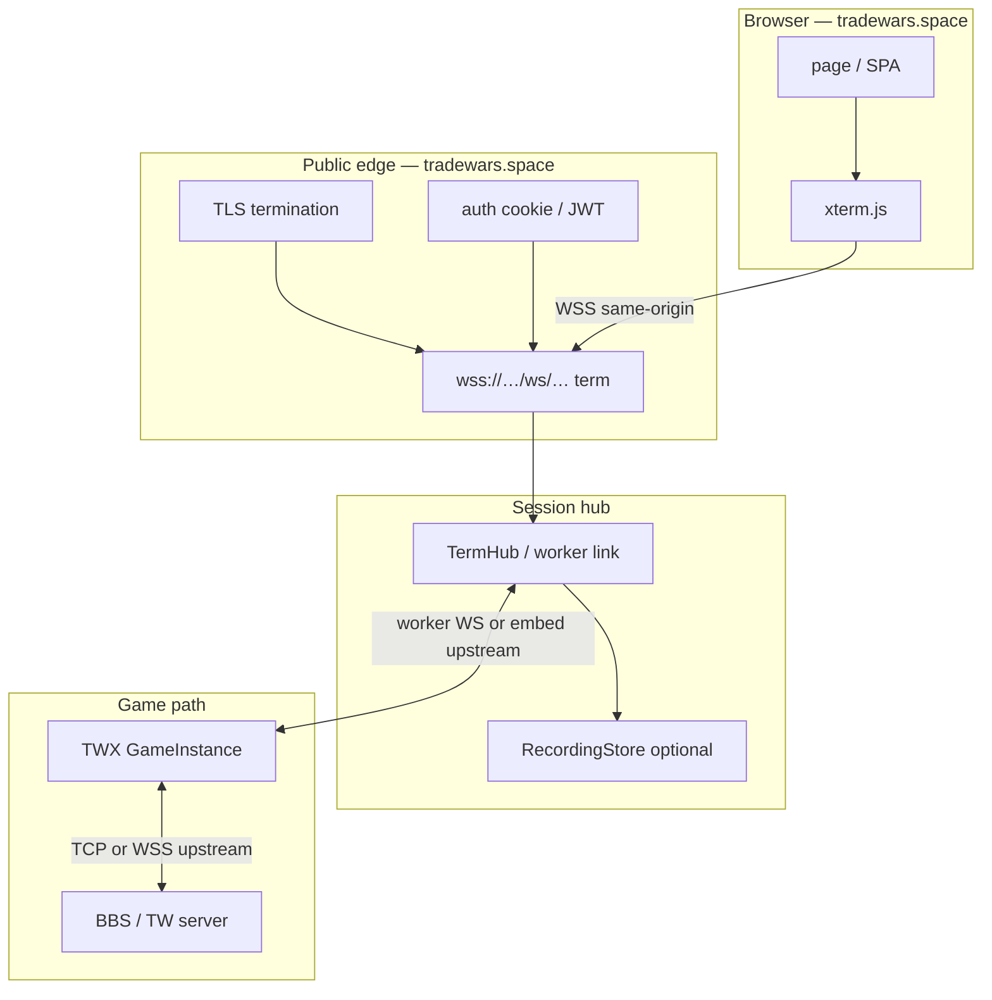
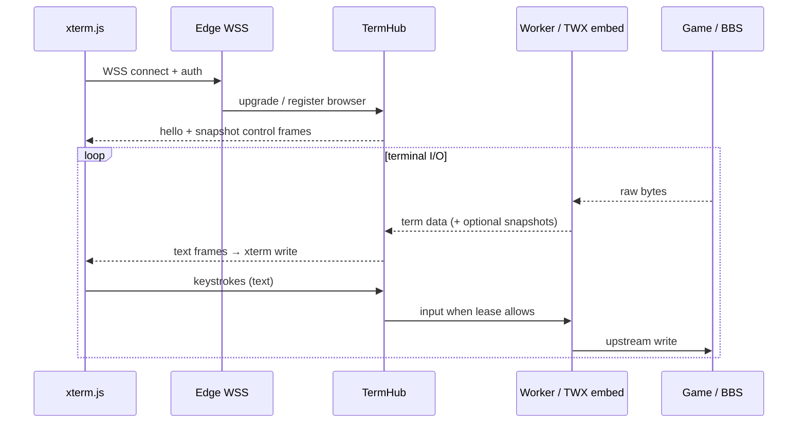

# tradewars.space — browser xterm → WSS architecture

**Status:** design / as-built notes  
**Date:** 2026-07-12  
**Related:** TWX `feat/uterm-embed` (local front doors), provide-uterm TermHub browser WS

## Problem

Players (and operators) open a browser on **https://tradewars.space** with an
**xterm.js** terminal. That page must stream a live TW / TWX game session.

A naïve approach fails:

| Approach | Why it fails |
|----------|----------------|
| `ws://127.0.0.1:…` from the public page | Mixed content (HTTPS page → insecure WS); browsers also block private-network access from public sites |
| CORS-only “fix” | CORS does not authorize WebSocket upgrades; origin checks still apply |
| Long-poll REST for every keystroke | Latency and complexity destroy terminal feel |

**Requirement:** the browser opens a **same-origin (or same-site trusted) `wss://`**
WebSocket to an edge that already has access to the game session bytes.

## Target architecture



### Layers

1. **Browser (xterm.js)**  
   - Renders ANSI; sends keystrokes as WebSocket **text** frames (UTF-8).  
   - Opens `wss://tradewars.space/...` (or the site’s known API host), **not**
     loopback.

2. **Public edge**  
   - TLS + HTTP reverse proxy (or Cloudflare Worker / DO).  
   - Upgrades `/ws/browser/{session}/term` (or product-specific path) to the hub.  
   - Authenticates (cookie / bearer) before upgrade; injects principal for RBAC.

3. **Hub (provide-uterm TermHub)**  
   - Routes browser ↔ worker; leases (viewer / operator / admin); control frames
     (DLE/STX) mixed with raw terminal bytes.  
   - Optional recording (JSONL) via the thin HTTP surface:
     `GET …/recording`, `…/entries`, `…/download`, `POST …/annotate`.

4. **Game path (TWX)**  
   - **Upstream:** TCP host:port **or** `wss://…` (`WebSocketUpstream`) when the
     game is already behind a TLS WebSocket.  
   - **Local front doors (dev / desktop):** TWX can also listen for local
     TCP / WS / SSH clients into the same `GameInstance` — these are for UX and
     tooling on the machine, **not** for the public browser origin.

## Data plane (bytes)



- **Terminal data:** opaque bytes / UTF-8 text (as today on Python/Go/C# hubs).  
- **Control:** DLE/STX-framed JSON (hello, snapshot, hijack state, presence).  
- Do **not** send bare JSON on the term WebSocket without the control codec
  (CI guards bare JSON on term paths).

## Why local TWX front doors still matter

| Surface | Audience | Origin |
|---------|----------|--------|
| Public `wss://tradewars.space/…` | Web players | Same-site edge |
| TWX local WS listen | Desktop UX, embed tests | Loopback / LAN |
| TWX local SSH / TCP | Operators, scripts | Loopback / LAN |
| `wss://` **upstream** from TWX | Cloud-hosted BBS | Server-side only |

Local listeners are the **ship-local** UX path for TWX. They do **not** replace
the public edge; the browser on tradewars.space never dials them directly.

## Auth and roles

- **Browser role** resolved at hub connect: viewer (read) vs operator (input /
  hijack) vs admin.  
- Share links / tunnel tokens may mint constrained principals (`share:{session}:…`).  
- Recording download/read requires `session.recording.read` in addition to
  session read (parity across Python / Go / C# thin HTTP).

## Deployment sketch (tradewars.space)

```text
                    ┌─────────────────────────────┐
  Client browser ──►│ CDN / reverse proxy (TLS)   │
                    │  /          → static SPA    │
                    │  /ws/*      → hub WSS        │
                    │  /api/*     → hub REST       │
                    └─────────────┬───────────────┘
                                  │ private network
                    ┌─────────────▼───────────────┐
                    │ uterm hub (Py / Go / C#)    │
                    │  workers: TWX embed / PTY   │
                    └─────────────┬───────────────┘
                                  │
                    ┌─────────────▼───────────────┐
                    │ TW game / BBS (TCP or WSS)  │
                    └─────────────────────────────┘
```

Optional: Cloudflare Durable Object as the hub (see `provide-uterm-cloudflare`)
when the edge and session state should colocate.

## Anti-patterns

1. **Teaching the SPA to open `ws://127.0.0.1`** for production play.  
2. **Relying on CORS** to “allow” cross-origin WebSockets to a home TWX.  
3. **Exposing unauthenticated raw WS** to the public internet.  
4. **Skipping path confinement** on recording download (all ports enforce
   file under `recording.directory`).

## Implementation map

| Piece | Location |
|-------|----------|
| Browser term WS | `packages/provide-uterm-frontend` + hub `/ws/browser/{id}/term` |
| Python routes | `provide-uterm-server` `routes/sessions.py` |
| Go thin recording + sessions | `provide-uterm-go/server` |
| C# thin recording + sessions | `Provide.Uterm.Server.UtermServer` |
| TWX WSS upstream / local doors | TWX `feat/uterm-embed` (not pushed with provide-uterm) |
| Recording contract | [recording-store-parity.md](./recording-store-parity.md) |

## Acceptance criteria

1. From https://tradewars.space, xterm connects only via **`wss://` on the public host** (or documented same-site API host).  
2. Keystrokes and screen updates feel interactive (single WS, not REST polling).  
3. Auth gates the upgrade; viewers cannot inject input without operator/admin lease.  
4. Optional session recording is readable via the **thin HTTP surface** on the same hub language as deployed.  
5. Local TWX WS/SSH/TCP remain available for desktop/dev without being the public origin path.

## Out of scope (this doc)

- TWX product packaging / origin push policy.  
- Full browser replay UI parity on Go/C# (library + thin HTTP first).  
- Game protocol semantics (only the terminal transport).
