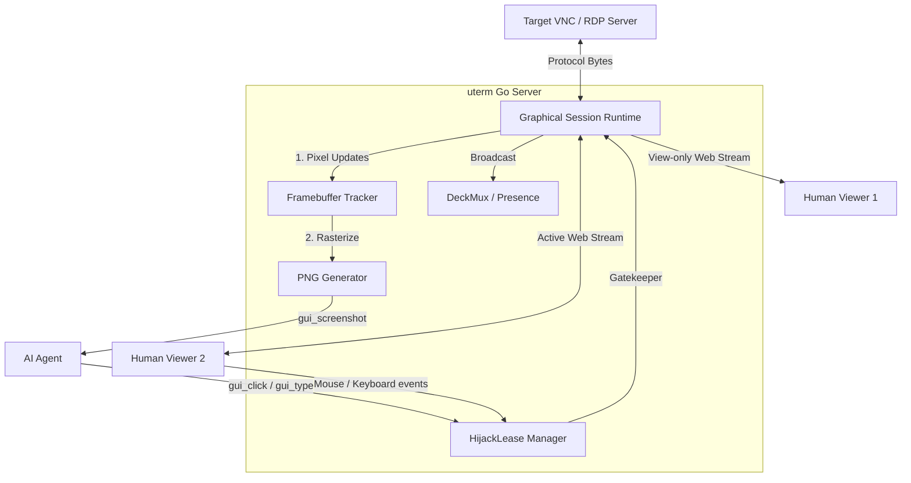

# Graphical Session Runtime (VNC/RDP) Design

## 1. Overview
The **Graphical Session Runtime** is a new core component in `uterm` that brings its signature collaboration features—presence, recording, and arbitrated control (hijack leases)—to graphical protocols like VNC and RDP.

By splitting a graphical session into a **broadcasted view** (framebuffer) and an **arbitrated input channel** (pointer/keyboard), it allows humans and AIs to collaboratively operate a graphical console. To ensure long-term flexibility, the system relies on a generic `GraphicalSession` interface, with VNC (RFB) serving as the initial hypervisor-level implementation, leaving a clean seam for future OS-level RDP integrations.

## 2. Architecture

The runtime sits between the remote target (e.g., `litevirt` ProxyVNC) and `uterm`'s consumers (browsers and AI agents).



### Components:
- **`GraphicalClient`**: A headless client that dials the target using a `CredentialProvider` (allowing token/JWT injection) and consumes the raw stream.
- **`FramebufferTracker`**: Maintains the canonical 2D pixel array in memory, translating protocol-specific updates into a standard Go `image.RGBA`.
- **`HijackLeaseManager` (Reuse)**: The existing `uterm` lock. Only the leaseholder's input events are forwarded to the remote server.
- **`DeckMux` (Reuse)**: Tracks the active roster of watchers (humans and AIs).

## 3. Core Go Interfaces

```go
package gui

import (
	"image"
)

// GraphicalSession represents an active connection to a remote graphical console (VNC, RDP, etc).
type GraphicalSession interface {
	// Framebuffer access for AI Vision Models
	Screenshot() (image.Image, error)

	// Input injection (Strictly gated by HijackLease)
	InjectPointer(x, y int, buttonMask uint8) error
	InjectKey(keySym uint32, down bool) error

	// Stream multiplexing for Humans
	// Returns a web-friendly stream (e.g., WebSocket-framed RFB for noVNC)
	// Inputs from this stream are dropped unless the subscriber holds the lease.
	Subscribe() (VideoStream, error)
}
```

## 4. The VNC (RFB) Backend Implementation

The initial implementation targets the RFB protocol to interface with `litevirt`/QEMU.

**Minimal "Raw" Parser**:
Instead of importing unmaintained and bloated Go VNC libraries that handle legacy encodings (Tight, ZRLE), `uterm` will vendor a minimal, purpose-built RFB parser. During the RFB handshake, the `uterm` client will explicitly advertise that it **only supports `Raw` and `CopyRect` encodings**.

The remote VNC server will be forced to send uncompressed pixel bytes. This makes the `FramebufferTracker` implementation exceptionally simple and robust: we simply read `x, y, w, h` bounds and drop the raw RGBA pixels straight into our Go `image.RGBA`. While this uses more internal backend bandwidth, it guarantees stable, fast PNG generation for the AI.

## 5. AI / MCP Tool Integration

To allow the AI to interact with the graphical console, `uterm` exposes generic graphical MCP tools. These operate on pixels and pointer events.

| Tool | Description |
| :--- | :--- |
| `gui_hijack_begin` | Request the hijack lease to take control of the mouse/keyboard. |
| `gui_hijack_release`| Release the lease, returning control to the pool/humans. |
| `gui_screenshot` | Returns a base64 PNG of the current `FramebufferTracker` state. Used by the vision model to "read" the screen. |
| `gui_click` | Arguments: `x` (int), `y` (int), `button` (string: "left", "right", "middle"). Moves the pointer and sends a click event. |
| `gui_type` | Arguments: `text` (string). Translates a string into a sequence of key down/up events. |
| `gui_key` | Arguments: `key_name` (string: "Enter", "Tab", "Esc"). Sends special keys. |
| `gui_drag` | Arguments: `start_x`, `start_y`, `end_x`, `end_y`. Simulates a click-and-drag motion. |

*Note: Just like text console tools, all injection tools (`gui_click`, `gui_type`, `gui_key`) will return an error if the AI has not first successfully called `gui_hijack_begin`.*

## 6. Human Viewer Flow

1. A human opens the `uterm` share link.
2. The browser loads the `uterm` UI, which embeds a web-friendly canvas (e.g., `noVNC` for RFB backends).
3. The browser connects via WebSocket to the `uterm` Go server.
4. The Go server adds the human to `DeckMux` and begins piping display updates to the browser.
5. **Arbitration**:
   - By default, `uterm` drops any pointer/key events sent from the browser.
   - The user clicks a "Take Control" button in the UI.
   - The Go server acquires the `HijackLease`.
   - Now, pointer/key events from this specific WebSocket are forwarded to the headless client and injected into the remote session.
